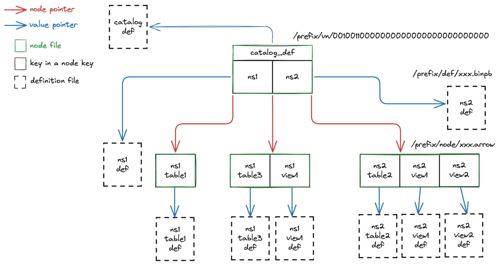

# Format

This page describes the complete Olympia catalog format on storage.

## Overview

The Olympia format defines a set of files that are within a specific prefix.
These files together forms a b-tree that records the information of objects in a catalog.
Here is an example:

The graph above describes an Olympia catalog at storage location `/prefix`.
The catalog is at version 100 with 1 root node and 3 child nodes forming a b-tree of order 4.
Each node of the b-tree is serialized as a file within the prefix. 
The root node is at location `/prefix/vn/00100110000000000000000000000000`,
and 3 child nodes at locations within `/prefix/node/`.

The b-tree is used as a key-value map, where the key encodes the object name,
and the value is a location within prefix that has the definition of the object as a serialized protobuf file.
For example, in this catalog there are object keys like `catalog_def`, `ns1`, `ns2.table2`, etc. with their corresponding definitions
as files at locations within `/prefix/def/`.

## B-Tree Concepts

### Search Tree

A search tree is a tree data structure used for locating specific **Key**s from within a collection of keys,
and used as an implementation of a **Set**. 
A search tree consists of a collection of **Node**s, and each node contains an ordered collection of keys.
To find if a target key is in the tree set, run the following algorithm:

Start from the root node, we first check see if the target is in the node.
If not, find the 2 consecutive keys that bound the target, or if the target is smaller or larger than all keys in the node.
This will either lead to searching a subsequent child node and eventually find the target in the set,
or if there is no child node to search, the key is not in the set.

### N-Way Search Tree

A **N-way search tree** is a search tree where:

1. A node with `k` children must have `k-1` number of keys.
2. Each node must have a maximum of `N` child nodes (i.e. each node must have a maximum of `N-1` keys)

### Search Tree Map

A search tree can not only be used as the implementation of a set, but also a key-value **Map**.
This can be achieved by storing the value together with its corresponding key.

When we talk about a tree in the context of Olympia, it is always a search tree map.
It is also common for a value in the map to be pointers to a much larger payload on disk.

### B-Tree

An N-way search tree only enforces the general requirements for the number of
children per tree node. The tree could become imbalanced over time. 
A b-tree (balanced tree) of order N is a self-balancing
N-way search tree that enforces a set of rules when updating the tree:

1. All leaf nodes must appear at the same level
2. The root node must have at least 2 children, unless it is also a leaf
3. All nodes, except for the root node and leaves, must have at least `⌈N/2⌉` children

### Pivot Table

For each node of a b-tree, there is an internal mapping of key to value and child node pointers.
A **Pivot Table** provides a way to describe such information in a tabular fashion.

Every key, value and node pointer tuple forms a row in this pivot table.
There are exactly `N` rows for each node in a `N`-way search tree.
The construction of the table follows the rules below:

1. The first row must have `NULL` key and `NULL` value, and the node pointer (if exists) points to the leftest child node.
2. Subsequent rows must be filled with non-null key and value from left to right.
   The node pointer at the row (if exists) points to the right child node of the key at the same row.
3. If there are less than `N-1` keys available to form `N` rows, the remaining rows are filled with all `NULL` values for key,
   value and node pointer.

For example, the pivot table of the root node in the example in overview would look something like:

| Key  | Value                          | Node Pointer                    |
|------|--------------------------------|---------------------------------|
| NULL | NULL                           | node/<some random value\>.arrow |
| ns1  | def/<some random value\>.binpb | node/<some random value\>.arrow |
| ns2  | def/<some random value\>.binpb | node/<some random value\>.arrow |

## Catalog Objects and Actions

Each type of object in a catalog has a Protobuf definition, as well as a set of actions related to the object.
See [objects.proto](https://github.com/olympiaformat/olympia/blob/main/proto/objects.proto) and 
[actions.proto](https://github.com/olympiaformat/olympia/blob/main/proto/actions.proto) for the actual definitions.

Each object has an increasing numeric type ID starting from 0.
At this moment, Olympia supports the following objects with their corresponding ID:

| Object Type             | ID |
|-------------------------|----|
| Catalog                 | 0  |
| Namespace               | 1  |
| Table                   | 2  |
| View                    | 3  |
| Distributed Transaction | 4  |

## Tree Key Encoding

There are 2 types of keys in the Olympia b-tree: system internal keys and object keys.

### System Internal Keys

System internal keys do not participate in the Olympia tree key sorting algorithm
and just provide metadata information about the specific node. Here is a list of them:

| Key Name           | Key                | Root Node Only | Description                                                                                           |
|--------------------|--------------------|----------------|-------------------------------------------------------------------------------------------------------|
| Catalog Definition | catalog_def        | Yes            | The catalog definition file pointer                                                                   |
| Previous Root Node | previous_root      | Yes            | The pointer to the last version of the root node                                                      |
| Rollback Root Node | rollback_from_root | Yes            | The pointer to the root node that was rolled back from, if the root node is created during a rollback |
| Creation Timestamp | created_at_millis  |                | The millisecond epoch timestamp that a node is created                                                |
| Number of Keys     | n_keys             |                | The number of rows that a node has                                                                    |

### Object Key

The object key is a UTF-8 string that uniquely identifies the object and also allows sorting it in a
lexicographical order that resembles the object hierarchy in a catalog.

#### Object Name Encoding

The object name has maximum size in bytes defined in the catalog definition file,
with one configuration for each type of object.

The following UTF-8 characters are not permitted in an object name:

- any control characters (hex value 00 to 1F)
- the space character (hex value 20)
- the DEL character (hex value 7F)

When used in an object key, the object name is right-padded with space up to the maximum size
(excluding the initial byte). The maximum size of each object is defined in the catalog definition file.

For example, a namespace `default` under catalog definition
`namespace_name_max_size_bytes=8` will have an encoded object name`[space]default[space]`.

#### Object Type ID Encoding

When used in the object key, the object type ID is encoded to a 4 character base64 string that uses the following encoding:

- Uppercase letters: A–Z, with indices 0–25
- Lowercase letters: a–z, with indices 26–51
- Digits: 0–9, with indices 52–61
- Special symbols: `+` and `-`, with indices 62–63
- Right padding character `=` if there are fewer than 4 characters after encoding

For example, object type ID `4` is encoded to `E===`.

#### Object Key Format

The object key format combines the encoded object key ID and encoded object name above to form a unique key
for each type of object. See the table below for the format for each type of object: 
(contents in `<>` should be substituted, space character is expressed as `[space]` for clarity)

| Object Type             | Object Key Format                                        | Example                                              |
|-------------------------|----------------------------------------------------------|------------------------------------------------------|
| Catalog                 | N/A, use the catalog definition key                      |                                                      |
| Namespace               | `B===<encoded namespace name>`                           | `B===default[space]`                                 |
| Table                   | `C===<encoded namespace name><encoded table name>`       | `C===default[space]table[space][space][space]`       |
| View                    | `D===<encoded namespace name><encoded view name>`        | `D===default[space]view[space][space][space][space]` |
| Distributed Transaction | N/A, distributed transaction is not persisted in catalog |                                                      |

## Files

Here are the different types of files.

### Node File

To persist the whole tree on storage, each pivot table is stored as a separated file that we call a **Node File**.
However, before storing the pivot table, it stores the system internal keys relevant to the node.
Because the pivot table must begin with a row of key and value both being `NULL`,
It is expected that a reader first read up to the first row of the pivot table, and read N keys of the pivot table
based on the "Number of Keys" system internal key.

Node files are stored under `node` folder within the catalog prefix, each node file is in Apache Arrow IPC format
with file name in the form of `<random uuid4>.arrow`.

### Root Node File

Root node file is a special kind of node file.

It also stores a list of actions performed in the last transaction after the pivot table.
For these rows, the `key` column stores the object that the action is performed on. 
The `value` column stores the action definition.

Root node files are stored in the `vn` (version) folder.
Each root node file is stored as the reversed binary value of the version number.
For example, version 100 is stored at `vn/00100110000000000000000000000000`.

### Object Definition File

Object definition files store the serialized protobuf binary for the specific object.

These files are stored in the `def` folder,
in the form of prefix `{object-type}/{uuid4}-{object-identifier}.binpb`.
For example, a table `t1` in namespace `ns1` and UUID `6fcb514b-b878-4c9d-95b7-8dc3a7ce6fd8` would give a path
`table/6fcb514b-b878-4c9d-95b7-8dc3a7ce6fd8-ns1-t1.binpb`,
to produce the final object definition file path.
For catalog, because thee is not an object identifier, files will be in the form of `catalog/{uuid4}.binpb`.

### Latest Version File

The latest version file is stored at `vn/latest`.
This is an optional text file that records the latest version of the node file,
The file contains a number that marks the presumably latest version of the tree root node, such as `100`.

### Oldest Version File

The oldest version file is stored at `vn/oldest`.
This is an optional text file marks the guaranteed oldest version of the tree root node, such as `100`.

## Transaction

### Storage Requirement

A storage used by Olympia must support the following basic operations:

- Read a file to a given location
- Write a file to a given location
- Delete a file at a given location
- Check if a file exists at a given location
- List files sharing the same prefix

In addition, a storage used by Olympia must support mutual exclusion of file creation.
This means only one writer wins if there are multiple writers trying to write to the same new file.
This is the key feature that Olympia relies on for enforcing ACID semantics during the commit process.

This feature is widely available in most storage systems, for examples:

- On Linux File System through [O_EXCL](https://linux.die.net/man/2/open)
- On Hadoop Distributed File System through [atomic rename](https://hadoop.apache.org/docs/stable/hadoop-project-dist/hadoop-common/filesystem/filesystem.html#boolean_rename.28Path_src.2C_Path_d.29)
- On Amazon S3 through [IF-NONE-MATCH](https://docs.aws.amazon.com/AmazonS3/latest/API/API_PutObject.html#API_PutObject_RequestSyntax)
- On Google Cloud Storage through [IF-NONE-MATCH](https://cloud.google.com/storage/docs/xml-api/reference-headers#ifnonematch)
- On Azure Data Lake Storage through [IF-NONE-MATCH](https://learn.microsoft.com/en-us/rest/api/storageservices/specifying-conditional-headers-for-blob-service-operations)

We can also treat key-value stores as a file system, where the key records the file path and value stores the file content bytes.
This further enables the usage of systems like:

- On Amazon DynamoDB through [conditional PutItem](https://docs.aws.amazon.com/amazondynamodb/latest/APIReference/API_PutItem.html)
- On Redis/Valkey through [SET NX](https://valkey.io/commands/set/)

### Begin a transaction

A transaction, either for read or write or both, will always begin with identifying the version of the Olympia tree
to look into. This version is determined by reading the latest and oldest version files.
If the latest version file exists and is larger than the oldest version file or if the oldest version file does not exist, 
we start to find the latest version at the version indicated by the file. 
Otherwise, we start from the version described by the oldest version file, or 0 if the oldest version file does not exist.
With that, we consecutively increment the version number until we find the verison `k` that returns a file not found error from storage.
After this process, we treat version `k-1` as the latest version to be used.

### Commit a transaction

#### Storage Atomic Commit

When committing a transaction, the writer will first write all non-root node files in parallel,
and then write the new root node file at the new version location atomically.
If this write is successful, the transaction is considered succeeded,
and the writer will perform a best-effort write of the latest version file.
If this write is not successful, the transaction commit step has failed at the storage layer.
Additional catalog commit conflict resolution is required to determine the proper action.

#### Catalog Commit Conflict Resolution

When a commit fails at storage level, catalog will examine all the actions performed by
inspecting the list of actions stored in the latest root node,
and reconcile with the current list of actions to see if the commit could still succeed.
If the commit could still succeed, the writer should update the commit to be performed against the latest root node
and redo the storage atomic commit.
Otherwise, the commit process should abort and report failure.

### Distribute a transaction

A transaction can be distributed by creating a distributed transaction object.
These objects are stored in the `dtxn` folder with name `{transaction-id}.binpb`.
The transaction can be resumed in another process by loading the specific distributed transaction object definition.

## Catalog Versioning Semantics

Here are the semantics to follow for catalog versioning related features of Olympia:

### Time Travel

Because the Olympia tree node is versioned, time travel against the tree root,
i.e. time travel against the entire Olympia catalog, is possible.

The timestamp-based time travel can be achieved by continuously tracing the previous root node key
to older root nodes, and check the creation timestamp key until the right root
node for time travel is found.

For version-based time travel, when the system version is a numeric value, it should map to the version of the tree root node.
The root node of the specific version can directly be found based on the root node file name.
When the system version is a string that does not resemble a numeric value, it should map to a possible exported snapshot.

### Catalog Rollback

Olympia uses the roll forward technique for rolling back any committed version.
If the current latest root node version is `v`, and a user would like to roll back to version `v-1`,
Rollback is performed by committing a new root node with version `v+1` which is most identical to the root node file `v-1`,
with the difference that the root node `v` should be recorded as the rollback root node key.

### Snapshot Export

A snapshot export for an Olympia catalog means to export a specific version of the Olympia tree root node,
and all the files that are reachable through that root node.
Every time an export is created, the catalog definition should be updated to record the name of the export
and the root node file that the export is at.

There are many types of export that can be achieved, because the export process can decide to stop replication
at any level of the tree and call it an export.
At one extreme, a process can replicate any reachable files starting at the root node. We call this a **Full Export**.
On the other side, a process can simply replicate the specific version of tree root node,
and all other files reachable from the root node are not replicated. We call this a **Minimal Export**.
We call any export that is in between a **Partial Export**.

Any file that is referenced by both the exported snapshot and the source catalog might be removed by the
catalog version expiration process.
With a full snapshot export, all files are replicated and dereferenced from the source catalog.
With a partial or minimal export, additional retention policy settings are required to make sure the
version expiration process still keep those files available for a certain amount of time.

