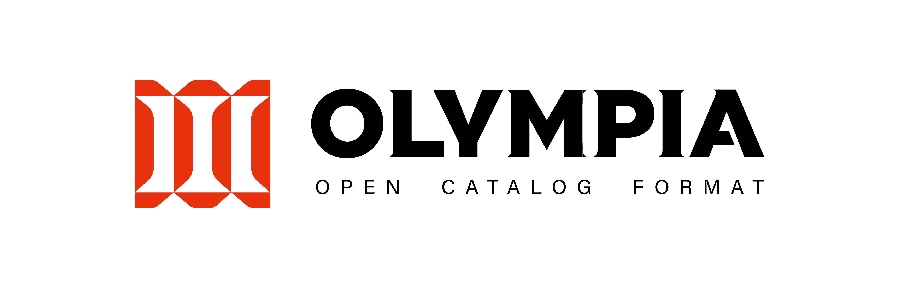

# Olympia Format

Olympia is a storage-only **Open Catalog Format** for big data analytics, ML & AI. 
It defines a file spec and layout on storage to store and access metadata 
for commonly used objects in a data lakehouse like Apache Iceberg tables, Substrait views, etc.

Olympia is designed for the following key use cases and features:

### Scalable, Lightweight and Portable Storage-Only Lakehouse Catalog

If you would like a lightweight lakehouse catalog that can scale to millions or even billions of objects
without the need to run a server or use a vendor catalog integration,
Olympia is the perfect solution for you.

Olympia only relies on one storage primitive - mutual exclusion of file creation, which is available in almost all
storage solutions including Linux file system, Apache HDFS, Amazon S3, Google Cloud Storage,
Azure Data Lake Storage, etc.
Olympia as a format also uses relative paths across the board, 
so that you can easily port your Olympia catalog from one storage to another by simply copying all the contents a directory.

### Embedded Component for Catalog Server Standards

If you would like to build a catalog server that is compliant with 
open or proprietary catalog standards like Apache Iceberg REST catalog standard,
you can use Olympia to handle all the technical complexities of interacting with different types of objects in a catalog,
and put your focus on developing business logic in your catalog server such as authentication, 
server routing, server monitoring, etc.

### Multi-Object Multi-Statement Transactions

Olympia enables multi-object multi-statement transactions across all objects managed by the catalog.
You can easily perform operations like atomically committing multiple tables, 
atomically refreshing a view after updating a table while ensuring 
SNAPSHOT or SERIALIZABLE isolation level across the entire lakehouse.
We also provide commonly seen transaction SQL extensions like
`BEGIN TRANSACTION`, `COMMIT TRANSACTION`, `ROLLBACK TRANSACTION` in open engines like Apache Spark.

### Consistent Time Travel, Rollback and Snapshot Export

Every time a new change happens in an Olympia catalog, a new version of the catalog is created.
This means the whole catalog is versioned and can support time travel and version travel.
Compared to single table time travel feature provided by open table formats, 
Olympia time travel ensures that all objects in a catalog are in the specific point in time,
avoiding data errors created by inconsistent states across different tables.
In addition, you can roll back an entire catalog to a specific previous state,
or export everything in a catalog at a point of time as a snapshot.

### Distributed Transaction

Olympia enables advanced transaction semantics like distributed transaction 
that is had been only available in relational database products like Microsoft SQL Server.
When beginning a distributed transaction in an Olympia catalog,
the transaction can be passed around different processes across any supported compute engines.
This is useful for write-audit-publish workloads where a writer can pass a transaction to an auditor for review,
and eventually be committed into the catalog through a publisher.
Compared to similar write-audit-publish features provided at table format level,
Olympia allows arbitrary operations against any number and any type of object 
to be processed in the workflow atomically.